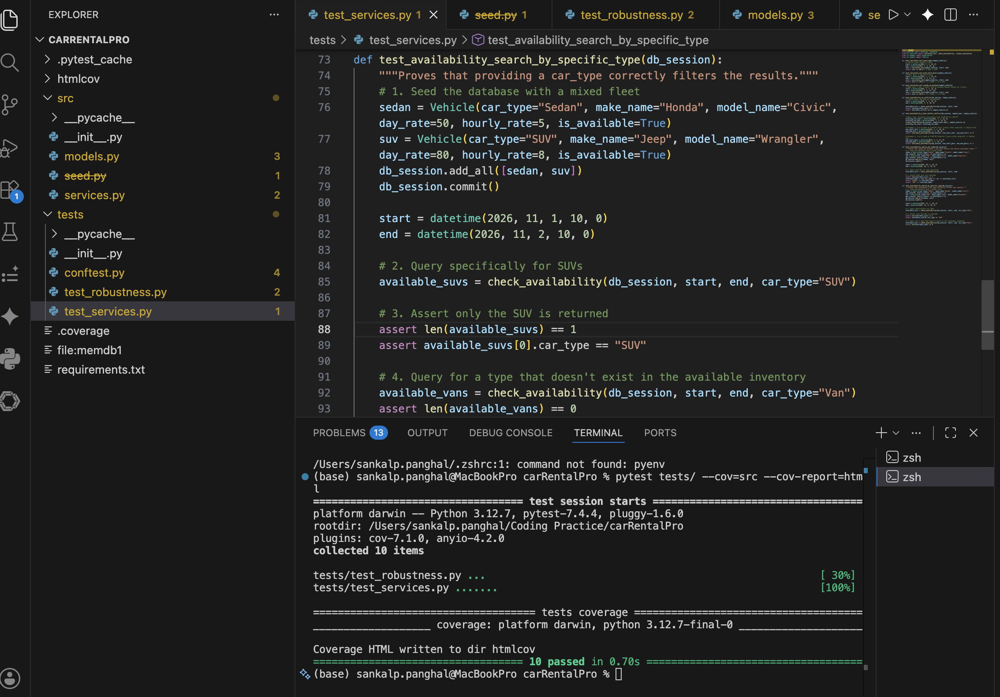

# Car Rental System MVP

[Document for car_rental by Sankalp](https://docs.google.com/document/d/1oasHebCEE622J5_NQXTzgJngDrRygNOaeP5tqHOLLZ0/edit?usp=sharing)


A simple and simulated backend service for managing car rentals.

This project implements a relational database architecture to handle vehicle inventory, dynamic pricing calculations, and strict booking concurrency.

## Features

* **Inventory Management:** Tracks distinct vehicles with specific day and hourly rates.
* **Availability Engine:** Calculates real-time availability, enforcing mandatory 3-hour maintenance buffers between reservations.
* **Concurrency Handling:** Utilizes strict database locking mechanisms to prevent double-booking race conditions.
* **Test-Driven:** Comprehensive test suite validating financial calculations and high-load concurrency scenarios.

## Core Functionalities

The application currently supports the following backend operations:

* **Query Available Vehicles:** Search the database for cars available between a specific `start_time` and `end_time`. 
  * *Filtering:* Can return the entire available fleet or filter by specific classes (e.g., `Sedan`, `SUV`, `Van`).
  * *Buffer Enforcement:* Automatically filters out any vehicles that do not have a clear 3-hour maintenance window before and after the requested times.
* **Dynamic Pricing Engine:** Automatically calculates the total cost of a reservation prior to booking.
  * Calculates total full days multiplied by the vehicle's `day_rate`.
  * Calculates remaining hours multiplied by the vehicle's `hourly_rate` (rounding up any fractional hours).
* **Create Reservation:** Locks a specific vehicle for a user.
  * Utilizes database row-level locking to guarantee a vehicle cannot be double-booked, even under high concurrent load.
  * Stores the user ID, vehicle ID, timestamps, and the calculated total cost.

## Running Project
pip install -r requirements.txt
pytest -v


## Project Structure

```text
car_rental_system/
├── src/
│   ├── models.py           # SQLAlchemy database schemas
│   ├── services.py         # Core business logic and query interfaces
│   └── seed.py             # Utility for generating randomized mock data
├── tests/
│   ├── conftest.py         # Database fixtures and shared in-memory setup
│   ├── test_services.py    # Business logic and calculation tests
│   └── test_robustness.py  # Concurrency and edge-case validation
├── requirements.txt        # Project dependencies

```

### Unit Test Screenshot

